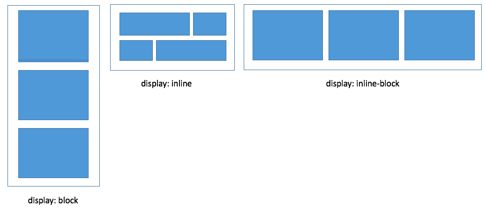

#### CSS Quiz Answers
1. Which of the following are block elements?
  `p`, `ul`, `ol`, `li`, `th`, `tr`, `td`, `div`, `input`, `fieldset`

2. What is the term for the other elements? `inline`

3.  If the following four attributes were applied to an inline element, which (if any) would have an effect?
  ```
  background-color: red
  display: block
  ```

  The position attribute would not have an effect because there is no offset attribute to tell it where to move relative to its normal flow.  

  And, unlike block elements, inline elements do not have height or width.  

4. Given the following example:

  ```
  <div>
    <p></p>
    <ul>
      <li><a></a></li>
      <li><li>
    </ul>
    <ol>
    </ol>
  </div>
  ```
  * which element is the *parent* of the ul element? `div`

  * which element(s) are the *siblings* of the ul element? `p` `ol`

  * which element(s) are the *children* of the ul element? both `li`'s (but not the `a`)

5.  What items will be selected by each of the following?  Also, describe the practical difference between each item and the one above it.

  ```
  p - all p elements, unless overwritten later due to specificity or order

  .navigation - all elements (p and all others) with navigation class

  #navigation - the single item with a navigation id

  p.navigation - all p elements with a navigation class.  other elements (i.e. ul, etc) with this class will not be selected.  

  p>.navigation - all items with navigation class that are the children of a p element.  other items with navigation class will not be selected.  

  p .navigation - all items with navigation class that are the children or other descendent of a p element.  other items with navigation class will not be selected.  
  ```

6. Order the above in terms of specificity weighting.
  1. `#navigation`,
  2. (tied) `p.navigation`, `p>.navigation`,`p .navigation`,
  5. `.navigation`,
  6. `p`  

7.  Given the following HTML and CSS samples, answer the following questions:

  ```
  <div>
    <p class="sample" id="first"></p>
    <p class="sample" id="second"></p>
    <p id="last"></p>
  </div>
  ```

  ```
  p#first {
    color: green
  }
  #first {
    color: red
  }
  #second {
    color: purple
  }
  p {
    color: blue
  }
  .sample {
    color: pink
  }
  ```

  * what color is the first p element? `green`

  * what color is the second p element? `purple`

  * what color is the third p element? `blue`

8. If you have the following, what's the practical result of giving the p and ul elements a position of `float: left` and `width: 200px`? *They would be aligned in columns next to each other*
  ```
  <div>
    <p></p>
    <ul>
    </ul>
  </div>
  ```

  *  what would happen if you didn't specify the width of the p and ul elements? *Nothing (assuming the content of the paragraph element filled more than the width of the screen).  They would flow underneath each other as they normally would because, as block elements, they would fill up the available horizontal space.*

  * what would it look like if the total screen width was 300px?
  *The p and ul elements would be aligned vertically because there would not be enough space to fit both.*

  * if you had a background color on the div element, would the background color show up around the full height of its child elements?  Why or why not?  If not, how can you address this? *No.  The container element (the div) would collapse because all of its children are floated.  A common way to get the div element to envelope its children is to use a technique called `clearfix`.*

9.  What display type is demonstrated in each of the following:
  

10. When you specify `position: absolute` - the absolutely positioned element will be positioned relative to what? *The next parent element that is also "positioned".  If none, it defaults up to the `html' element* Does it remain in the normal flow?  *No*

11. What else needs to be specified for a relative position to have any effect? *An offset property like `top`, `bottom`, `left` or `right`*

12. What position would you use if you wanted to have a sidebar element showing no matter where the user is currently positioned on the page? `position: fixed`

13. Will an absolute positioned element always be visible to the user, no matter where the user is on the page?  *No.  It is positioned in relation to its nearest relative/absolutely positioned parent element (or html element if none).  If that containing element is no longer visible, the absolute positioned item will not be visible.  Fixed positioned elements are always visible and are fixed relative to the browser window*

14.  Given the following, what element will the p element be absolutely positioned relative to?  What does this look like?  *It will be positioned relative to the `div` element.  It will start 100px below the top of the div element.  The div element will be positioned 100px below where it would have otherwise fallen naturally.*

  ```
  <body>
  <div id="absContainer">
    <p id ="abs"></p>
  </div>
  </body>
  ```

  ```
  #absContainer {
    position: relative;
    top: 100px
  }

  #abs {
    position: absolute;
    top: 100px
  }
  ```
15.  Would anything change  above if the div element was not given a position?  *Yes.  In that case, the p element would be positioned 100px below the top of the html page.*

16. Give an example of a situation where you may want to give something an absolute position.  Why is it necessary?  Do the same for fixed and float. *Absolute:  Maybe you have a title element that you want to display on top of a banner image  The  absolute position would let you have the title overlap.  Fixed:  Maybe there is an element that you always want displayed.  Maybe a help screen that scrolls down the window on a form as the user completes the form.  Otherwise, the user may not realize there is a help option available when they run into trouble with the form.  Float:  If you want elements aligned in columns.  Otherwise, block elements expand to take up all horizontal space and a column would not be possible.*  

17.  Which of the following takes the element out of normal flow? *All except `position: static`.  When you take items out of normal flow, they have the possibility of overlapping.  To prevent this, you can give elements width properties that will keep them from overlapping.  Or if you can set the `z-index` to indicate which items should be on top of others.*
  ```
  position: static
  position: relative
  position: absolute
  position: float
  ```

18.  If you float the ul element left in the example below, what element will it float next to (assume available width).  Why? *The `p` element.  Because the p element is the sibling element immediately before it.*  
  ```
  <body>
    <div>
      <p></p>
      <ul>
        <li></li>
        <li></li>
      </ul>
    </div>
  </body>
  ```
19.  Where would the ul element be positioned if there was not available width? *below the p element*

20.  If you didn't give the p and ul elements a width, what would happen if you gave the ul element a floated position? Why? *Nothing, because the p element, as a block element, would take up the full width of the browser window*

21.  Given the following, what is the font size of the li element? *12px*

  ```
  <body>
    <ul>
      <li></li>
    </ul>
  </body>

  ```
  ```
  body {
    font-size: 20px;
    color: red;
    padding: 10px;
  }
  ul {
    font-size: 80%
  }
  li {
    font-size: 75%
  }
  ```
22.  If you want the li element above to be in red font, do you need to add a color to the li element above?  Why or why not?  *Color would be inherited from the body, so specifying color in the li element would not be necessary.* Will the li element have padding?  Why or why not?   *The li element will not have the same padding as the body unless set to 10 in the li element.  Padding is not inherited.*

23.  Label each part of the block element box below:  
  

24. If you want white space between two block elements, what attribute do you need to set? `margin`

25.	If you want to center text within a block vertically, what attribute do you need to set? `padding`

26.	How much total width will the div block below take up? *234px*

  ```
  div {
    width: 200px;
    border-weight: 2px;
    padding: 0px, 10px, 0px, 20px;
    margin: 10px, 0px;
  }
  ```
